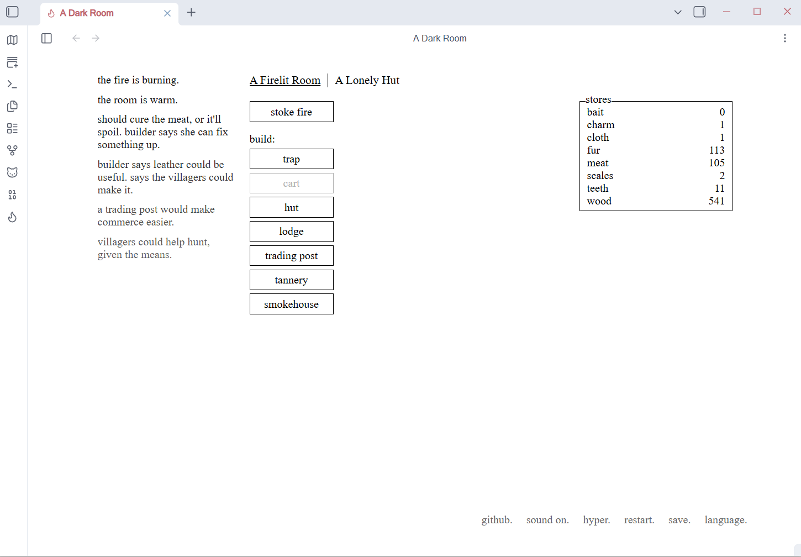
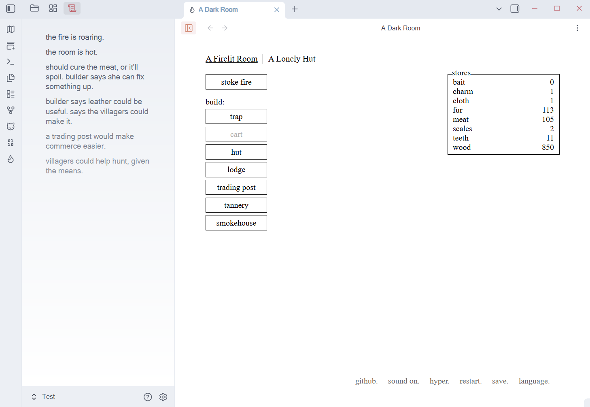
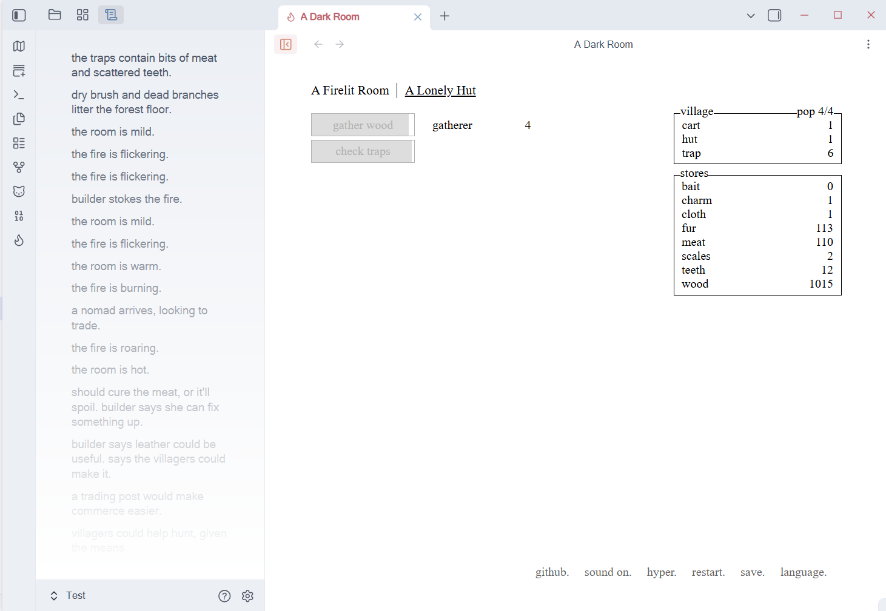

# Darkroom

> Bring [**A Dark Room**](https://github.com/doublespeakgames/adarkroom) — a minimalist text adventure — ported into Obsidian.

---

## ⚠️ Provenance and license

**This plugin is not the original game.** It is a port; the game itself was made by someone else. Please note the attribution below.

| | |
| --- | --- |
| Original work | **A Dark Room — A Minimalist Text Adventure** |
| Author / copyright | **Michael Townsend / Doublespeak Games** |
| Upstream repository | https://github.com/doublespeakgames/adarkroom |
| Pinned commit | `1fada4620b6c66bd07bf15a3f1eb8223df8bc1d7` (upstream v1.4) |
| **Original license** | **Mozilla Public License 2.0 (MPL-2.0)** — full text in [`A-DARK-ROOM-MPL-2.0.md`](./A-DARK-ROOM-MPL-2.0.md) |
| Adapter layer license | MIT — see [`LICENSE`](./LICENSE) |
| Full provenance & changes | [`THIRD_PARTY_NOTICES.md`](./THIRD_PARTY_NOTICES.md) |

The upstream source is **redistributed in [`src/game/upstream/`](./src/game/upstream) — every file there is byte-for-byte identical to the upstream tarball, except the stylesheets**: `css/**` and `lang/zh_cn/main.css` were scoped once and folded into the root [`styles.css`](./styles.css), which is now maintained by hand and is no longer generated at build time. Source availability under MPL-2.0 §3.2 is satisfied by the vendored tree plus the upstream repository linked above. Every change this plugin makes to the *runtime code* is applied **at build time**, only to the generated artifacts, and is itemised in the `buildTimeTransforms` field of [`src/game/upstream.meta.json`](./src/game/upstream.meta.json).

This port is not affiliated with or endorsed by Doublespeak Games. The name and content of "A Dark Room" belong to its original author.

---

## Effects




---

## What this is

A Dark Room begins with a dying fire. You light it in the dark; someone is drawn to the light. You send them out to scavenge, raise a village, and eventually walk into the empty world outside. It has almost no graphics — just text, whitespace and pacing.

This plugin turns it into a **native Obsidian view** rather than an embedded web page: the game renders directly into Obsidian's DOM, wired into the plugin lifecycle, save persistence and the command palette, and it exposes a public API for other plugins to hook into.

**This port is silent** — the original's sound effects and music are not bundled.

The interface ships with **all 25 languages that upstream provides**, and defaults to **English** (which is the upstream text itself, so no translation table is involved). Switch languages from the in-game menu at the bottom-right — its rightmost entry is the language picker, exactly as in the original. Your choice is remembered.

The look follows your Obsidian theme: light and dark are detected automatically, and the game paints no background of its own so your theme shows through.

## Install

Manual install:

1. Build the artifacts (or download a release), then copy `main.js`, `styles.css` and `manifest.json` into
   `<your vault>/.obsidian/plugins/obsidian-darkroom/`
2. Enable **Darkroom** under Settings → Community plugins

## Usage

Open the game from the ribbon icon (a flame) or the command palette:

| Command | What it does |
| --- | --- |
| **Darkroom: Open A Dark Room** | Opens (or focuses) the game view in a main-workspace tab |
| **Darkroom: Toggle compact mode** | Moves the notification feed into Obsidian's **left sidebar** so the game body narrows from 920px to 700px — handy when the view is too narrow for the full layout. There is also a button for this at the left end of the view's title bar |
| **Darkroom: Reset game** | Clears the save and starts over (same as the in-game *restart*) |

Notes:

- The game body always lives in the **main editor area**; only the notification feed can move to a sidebar.
- Progress is saved automatically, and the save file lives in the plugin's own `data.json` — so it syncs along with your vault
- The in-game **save** menu can export / import save codes
- The in-game **github** menu entry opens this plugin's repository

## Development

```bash
npm install
npm run dev        # watch + incremental build
npm run build      # production build, output in output/
npm run typecheck  # type check
```

`npm run build` first runs the build-time codegen (parses the upstream `index.html` and concatenates the scripts into an isolated runtime), then hands off to esbuild. The stylesheets are **not** generated: the root `styles.css` is the single, hand-maintained stylesheet.

### Layout

```
styles.css                the plugin's only stylesheet (hand-maintained; see its header)
src/
  main.ts                 plugin entry point, commands, runtime lifecycle
  settings.ts             persisted settings (language, compact mode)
  api/                    public API surface for other plugins
  view/
    DarkroomView.ts       the game view (main editor area) + title-bar button
    DarkroomPanelView.ts  sidebar view that hosts panels moved out of the game
  game/
    upstream/             A Dark Room upstream source (MPL-2.0; stylesheets excluded)
    upstream.meta.json    provenance, vendored/excluded lists, build-time change log
    runtime/              adapter code injected into the generated runtime
    generated/            build-time generated artifacts (not committed)
scripts/                  build-time codegen scripts
```

## License

- Adapter layer of this plugin: **MIT** ([`LICENSE`](./LICENSE))
- [`styles.css`](./styles.css): **mixed** — its main body is the scoped upstream stylesheet (**MPL-2.0**), while the trailing "本插件自身的样式" section is ours (**MIT**)
- `src/game/upstream/**` (A Dark Room upstream source and the bundled third-party libraries): **MPL-2.0** plus the respective licenses of each library ([`A-DARK-ROOM-MPL-2.0.md`](./A-DARK-ROOM-MPL-2.0.md), [`THIRD_PARTY_NOTICES.md`](./THIRD_PARTY_NOTICES.md))
